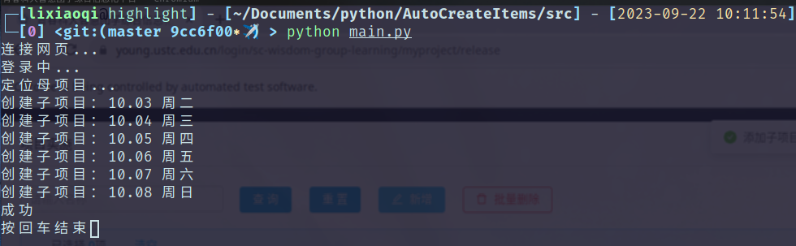

# 二课批量创建脚本

这是一个关于中国科学技术大学[第二课堂](https://young.ustc.edu.cn/login/sc-wisdom-group-learning/)的子项目批量申请脚本，目的是解放劳苦的班级/社团负责人，那些每学期要花费数个小时进行子项目申请的打工人。

这个脚本使用selenium驱动浏览器，实现了自动登陆并批量创建子项目，仅需提供信息，即可进行一键式创建。

这个脚本的亮点在于：

- 清晰的代码逻辑：易于维护，易于适应频繁变动的二课网页
- 配置文件：使用简单直观的json格式收集项目及个人信息，避免使用者需要深入修改代码才能适应自己的应用场景

也有一些不足：

- [ ] 某些web element的定位逻辑不够优秀(待汇总)
- [ ] 需要更细粒度的等待逻辑，以提高脚本的稳定性
- [ ] 考虑在报错时打包输出状态信息，以快速定位问题

## 使用场景

在继续阅读前，请检查脚本的设计初衷是否贴合你的应用场景。

以三五七为例，三五七是科考协会的一个“日常”活动，除去周一每天都有。其申请过程如下：

1. 申请母项目
2. 在母项目下申请子项目，每天的子项目都要单独申请
3. 子项目审核通过后即开始报名，对于三五七这种现场参加的活动，还需要指派二维码管理员

最为耗时的为2，申请每个子项目的填表大部分是重复的劳动：

- 联系人/项目简介/报名范围等，每次都填写相同的信息
- 举办时间/报名截止时间/子项目名称等，不完全一致，但是有很强的规律性

本脚本意在简化第2条的流程。（第三条也可以自动化，挖个坑。）脚本认为，这种周常/日常的活动，每次有固定的举办时间(几点至几点)，不同的举办日期间有均匀的天数间隔，基于此，脚本仅需最少配置信息即可完成子项目申请的自动化。

为了简化实现，脚本并不支持完全自定义地创建系列子项目，详见[配置说明](#config)。

## 使用说明

- python环境：安装好[python 3.8+](https://pypi.org/project/selenium/#supported-python-versions)，进入项目目录，安装依赖：`pip install -r requirements.txt`。

- 浏览器配置
  - 下载Chrome或者Chromium浏览器，这是因为[脚本代码使用的是Chrome驱动](https://github.com/lixiaoqi-LXQ/AAS/blob/master/src/AutoApply.py#L21C1-L22C56)
  - [下载Chrome驱动](https://chromedriver.chromium.org/downloads)，选择匹配自己浏览器内核版本的
    > 查看自己浏览器的内核版本：打开网址chrome://settings/help，看到类似Version 114.0.1823.67，即为内核版本

- 根据[配置说明](#config)修改配置

一切准备就绪，使用命令行进入`src`文件夹，`python main.py`即可运行。

运行过程中，命令行会输出相关信息，以某次运行为例，如下即为成功运行：

创建子项目后，脚本使用暂存选项，也可改为直接提交，详见https://github.com/lixiaoqi-LXQ/AAS/blob/master/src/AutoApply.py#L133

如果运行失败，请检查命令行输出的报错信息，检查自己的配置文件，检查[运行假设](#assumption)……如果出现了匪夷所思的问题，可能是某些实现上的漏洞，由于网络波动出现了未考虑到的情况，那么：再运行一次。

## 配置说明

配置文件使用[JSON](https://zh.wikipedia.org/wiki/JSON)格式，需要获得的信息都以键(Key)的形式给出，用户只需要填入对应的值(Value)即可。

JSON的顺序不重要，但是为了清晰，这里将按照仓库中初始[配置文件](./config.json)的Key顺序逐一介绍。

- 个人信息：填入项目创建人的学号及密码

- 配置信息

  - driver位置：下载好的driver路径，可以使用绝对路径，也可以使用相对路径(注意是相对`src/main.py`)
  - 两个网址，是为了应对可能的网址变动，如果网址正常，不要改动

- 项目信息

  - 母项目名称：如名

  - 批量创建信息

    - 批量创建数量：创建子项目数量
    - 间隔天数：两个子项目之间(均匀)间隔几天
    - 开始日期：第一个子项目的日期，格式为`xxxx-xx-xx`，如`1970-01-01`

    假设三个参数分别为3, 2, 2023-09-29，那么创建的3个子活动日期分别为2023-09-29, 2023-10-01, 2023-10-03

  - 固定信息

    - 名称格式：考虑到每个子项目的名称都有所不同，且大概是和日期有关，所以设计这里填入的是[待格式化的字符串](https://docs.python.org/3/library/stdtypes.html#str.format)，运行时用来格式化的是python内建的[Date对象](https://docs.python.org/3/library/datetime.html?highlight=date#date-objects)，实现详见https://github.com/lixiaoqi-LXQ/AAS/blob/master/src/Config.py#L39

      可以填入的指示符以及获得的效果如下：

      | 指示符 | 含义                                                         | 示例                          |
      | ------ | ------------------------------------------------------------ | ----------------------------- |
      | `%a`   | Weekday as locale’s abbreviated name.                        | 一、二、……、日                |
      | `%A`   | Weekday as locale’s full name.                               | 星期一、……、星期日            |
      | `%w`   | Weekday as a decimal number, where 0 is Sunday and 6 is Saturday. | 0, 1, ..., 6                  |
      | `%d`   | Day of the month as a zero-padded decimal number.            | 01, 02, …, 31                 |
      | `%b`   | Month as locale’s abbreviated name.                          | 1月、……、12月                 |
      | `%B`   | Month as locale’s full name.                                 | 一月、……、十二月              |
      | `%m`   | Month as a zero-padded decimal number.                       | 01, 02, ..., 12               |
      | `%y`   | Year without century as a zero-padded decimal number.        | 00, 01, …, 99                 |
      | `%Y`   | Year with century as a decimal number.                       | 0001, …, 2023, …, 9998, 99991 |

    - 联系人/联系方式：如名
    
    - 有效时长/学时：如名，整数/小数
    
    - 图片文件夹：填写路径
    
    - 项目简介/组织方构想/报名人数限制/报名范围：如名
    
    - XX时间：填写`xx:xx`的格式，比如`18:00`
    
  - placeholders：这里的数据是为了定位输入框，其中Value是输入框中的占位符，如果没有变化，不需要更改

## 运行假设

为了实现的简洁，脚本运行过程中有一些假设，这些假设被打破，会导致脚本运行失败：

- 在等待页面加载时，脚本的判断依据是用户欢迎信息，即二课界面右上角的“欢迎您，XXX”，这里假设有两点：
  - 活动申请人(config.json中填写的)与当前登陆的是同一个人
  - 浏览器窗口尺寸没有过小而导致欢迎信息被折叠
- 定位母项目时，需要从若干曾经申请过的母项目中寻找，这里假设所寻找的母项目没有超过一页显示

## 鸣谢

wxy同学的初始代码提供了很大的参考价值。
